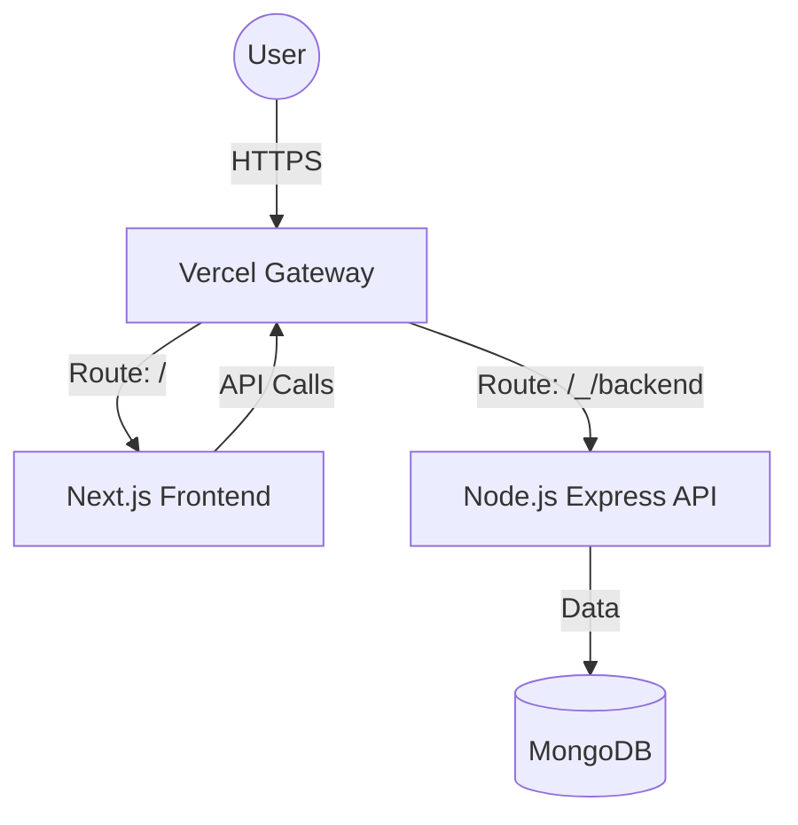

#  Nyayasetu: Gateway of Justice

[](https://opensource.org/licenses/MIT)
[]()
[]()
[]()

**Nyayasetu** is an AI-powered digital platform designed to bridge the gap between citizens and the Indian legal system. Specifically tailored for rural and semi-urban populations, it simplifies complex legal procedures and the **Bharatiya Nyaya Sanhita (BNS)** through a multilingual, voice-enabled interface.

---

## 🌟 Overview

### The Real-World Problem
In India, legal literacy remains a significant challenge, especially in rural areas. Complex legal jargon, language barriers, and limited access to legal experts often leave citizens unaware of their fundamental rights and the remedies available to them.

### Our Solution
Nyayasetu (meaning "Justice Bridge") serves as a digital assistant that:
- **Demystifies Law**: Converts complex legal sections into simple, everyday language.
- **Breaks Language Barriers**: Provides information in multiple Indian languages.
- **Ensures Accessibility**: Uses voice interaction for users who may have difficulty reading or typing.
- **Empowers Citizens**: Offers quick access to BNS sections and legal resources.

---

## 🚀 Key Features

### 💻 Software Features
- **Digital Justice Portal**: A secure, government-authenticated dashboard for legal services.
- **Multilingual Interface**: Support for various Indian regional languages to ensure inclusivity.
- **Secure Authentication**: Robust user login and registration system for protecting sensitive legal data.
- **Searchable Law Database**: Quick access to specific sections of the Bharatiya Nyaya Sanhita (BNS).

### 🤖 AI & Hardware-Integrated Features
- **Voice Interaction**: Integrated Speech-to-Text (STT) and Text-to-Speech (TTS) for hands-free operation.
- **NLP Assistant**: An AI-powered chatbot that understands and responds to legal queries in natural language.
- **Simplified Explanations**: Generative AI models that summarize legal text into easy-to-understand snippets.

---

## 🏗 System Architecture

The system is architected as a decoupled multi-service application, optimized for cloud-native deployment.



- **Frontend**: Next.js application served from the `frontend/` directory.
- **Backend**: Node.js Express server located in `backend/`, adapted for Vercel Serverless Functions.
- **Multi-Service Routing**: Managed by `vercel.json` using `experimentalServices`.

---

## 🚀 Vercel Deployment (CLI)

This project is configured for seamless deployment to Vercel using the Vercel CLI.

### Prerequisites
1.  Install Vercel CLI: `npm install -g vercel`
2.  Login to Vercel: `vercel login`

### Deployment Steps

1.  **Environment Variables**:
    *   In the Vercel Dashboard, add `MONGODB_URI` to your project environment variables.
    *   The frontend automatically connects to the backend via the `/_/backend` prefix.

2.  **Deploy to Preview**:
    ```bash
    vercel
    ```

3.  **Deploy to Production**:
    ```bash
    vercel --prod
    ```

### Configuration Details (`vercel.json`)
The project uses the `experimentalServices` feature to deploy both frontend and backend in a single project:
- **Frontend Entrypoint**: `frontend` (Next.js)
- **Backend Entrypoint**: `backend/index.js` (Express)
- **Routing**: Backend is exposed under the `/_/backend` path prefix.

---

## ⚙️ Local Development

To run the full stack locally with Vercel-like routing:

1.  **Install Dependencies**:
    ```bash
    # Root directory
    cd backend && npm install
    cd ../frontend && npm install
    ```

2.  **Run with Vercel Dev**:
    ```bash
    vercel dev -L
    ```
    *Note: The `-L` flag ensures all services run together locally.*

---

## 📁 Project Structure (Cleaned)

```text
NyayaSetu/
├── frontend/                # Next.js web application
│   ├── src/
│   │   ├── app/             # App Router
│   │   ├── components/      # React components
│   │   ├── lib/             # API utilities (api.ts)
│   │   └── styles/          # Tailwind & Global CSS
│   └── package.json
├── backend/                 # Node.js + Express API
│   ├── index.js             # Vercel-adapted entry point
│   └── package.json
├── vercel.json              # Multi-service deployment config
└── README.md                # Project documentation
```

---

## 🤝 Contributors

- **Santanu Samanta** - *Lead Developer & AIML Engineer* - [santanu949](https://github.com/santanu949)

---

## 📄 License
This project is licensed under the MIT License.
