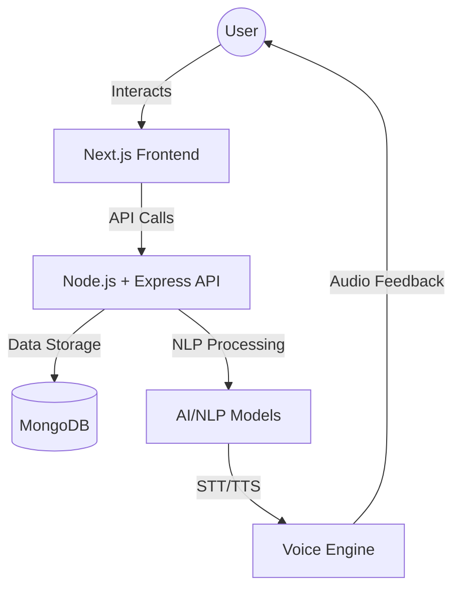

# ⚖️ Nyayasetu: Gateway of Justice

[](https://opensource.org/licenses/MIT)
[]()
[]()
[]()

**Nyayasetu** is an AI-powered digital platform designed to bridge the gap between citizens and the Indian legal system. Specifically tailored for rural and semi-urban populations, it simplifies complex legal procedures and the **Bharatiya Nyaya Sanhita (BNS)** through a multilingual, voice-enabled interface.

---

## 🌟 Overview

### The Real-World Problem
In India, legal literacy remains a significant challenge, especially in rural areas. Complex legal jargon, language barriers, and limited access to legal experts often leave citizens unaware of their fundamental rights and the remedies available to them.

### Our Solution
Nyayasetu (meaning "Justice Bridge") serves as a digital assistant that:
- **Demystifies Law**: Converts complex legal sections into simple, everyday language.
- **Breaks Language Barriers**: Provides information in multiple Indian languages.
- **Ensures Accessibility**: Uses voice interaction for users who may have difficulty reading or typing.
- **Empowers Citizens**: Offers quick access to BNS sections and legal resources.

---

## 🚀 Key Features

### 💻 Software Features
- **Digital Justice Portal**: A secure, government-authenticated dashboard for legal services.
- **Multilingual Interface**: Support for various Indian regional languages to ensure inclusivity.
- **Secure Authentication**: Robust user login and registration system for protecting sensitive legal data.
- **Searchable Law Database**: Quick access to specific sections of the Bharatiya Nyaya Sanhita (BNS).

### 🤖 AI & Hardware-Integrated Features
- **Voice Interaction**: Integrated Speech-to-Text (STT) and Text-to-Speech (TTS) for hands-free operation.
- **NLP Assistant**: An AI-powered chatbot that understands and responds to legal queries in natural language.
- **Simplified Explanations**: Generative AI models that summarize legal text into easy-to-understand snippets.

---

## 🏗 System Architecture

The system follows a modern MERN-like architecture with a focus on AI integration.



1.  **Frontend**: Built with Next.js and TailwindCSS for a responsive, accessible UI.
2.  **Backend**: Express.js server handling routing, authentication, and API logic.
3.  **Database**: MongoDB for storing user profiles and legal query history.
4.  **AI Layer**: Transformer-based models for NLP tasks and specialized engines for STT/TTS.

---

## 🛠 Tech Stack

| Layer | Technology |
| :--- | :--- |
| **Frontend** | React, Next.js (App Router), TailwindCSS, Lucide React |
| **Backend** | Node.js, Express.js |
| **Database** | MongoDB (Mongoose ODM) |
| **AI/ML** | Transformer Models, NLP, Speech-to-Text, Text-to-Speech |
| **Dev Tools** | TypeScript, ESLint, PostCSS |

---

## ⚙️ Setup and Installation

### Prerequisites
- Node.js (v18 or higher)
- npm or yarn
- MongoDB instance (Local or Atlas)

### Step-by-Step Installation

1.  **Clone the Repository**:
    ```bash
    git clone https://github.com/santanu949/Nyayasetu-Gateway-of-Justice.git
    cd Nyayasetu-Gateway-of-Justice-main
    ```

2.  **Setup Backend**:
    ```bash
    cd backend
    npm install
    # Create a .env file and add:
    # PORT=5000
    # MONGODB_URI=your_mongodb_connection_string
    npm start
    ```

3.  **Setup Frontend**:
    ```bash
    cd ../frontend
    npm install
    npm run dev
    ```

4.  **Access the App**:
    Open [http://localhost:3000](http://localhost:3000) in your browser.

---

## 📖 Usage Guide

1.  **Onboarding**: Users start at the welcome screen where they can sign up or sign in.
2.  **Dashboard**: Once logged in, users can access various legal services through the "Digital Justice Portal."
3.  **Legal Queries**: Type or speak a legal question (e.g., "What are my rights if I am arrested?") into the AI assistant.
4.  **Voice Mode**: Click the microphone icon to activate voice commands and hear responses read aloud.
5.  **BNS Search**: Browse or search for specific sections of the Bharatiya Nyaya Sanhita to get simplified summaries.

---

## 📁 Project Structure

```text
NyayaSetu/
├── frontend/                # Next.js web application
│   ├── src/
│   │   ├── app/             # App Router (pages & layouts)
│   │   ├── components/      # React components (Hero, Nav, Auth)
│   │   │   └── ui/          # shadcn/ui inspired components
│   │   ├── styles/          # Tailwind & Global CSS
│   │   └── lib/             # Utility functions
│   ├── public/              # Static assets (images, icons)
│   └── package.json
├── backend/                 # Node.js + Express API
│   ├── src/                 # API logic & models
│   ├── server.js            # Main entry point
│   └── package.json
└── README.md                # Project documentation
```

---

## 📈 Current Status & Roadmap

- [x] Phase 1: Basic Legal Awareness Portal & AI Summarization.
- [ ] Phase 2: Full Multilingual Voice Assistant Integration.
- [ ] Phase 3: Direct Integration with Govt Legal Schemes & e-Courts.
- [ ] Phase 4: Mobile Application Launch (Android/iOS).

---

## 🤝 Contributors

- **Santanu Samanta** - *Lead Developer & AIML Engineer* - [santanu949](https://github.com/santanu949)

---

## 📄 License
This project is licensed under the MIT License - see the [LICENSE](LICENSE) file for details.
